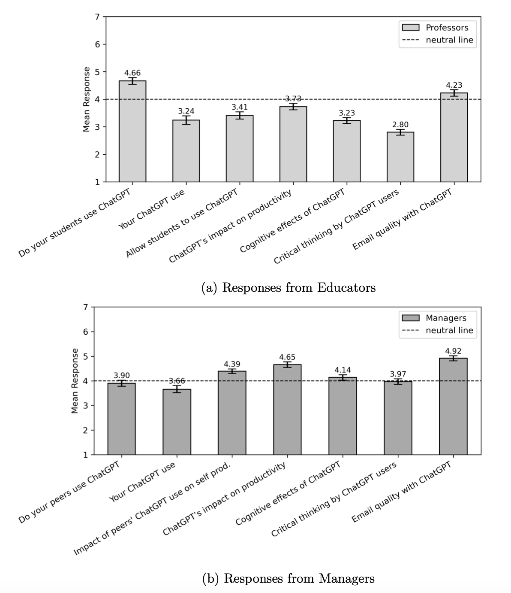

<style>
.caption {
  text-align: center;
  font-size: 14px;
}
</style>

<!--
.caption:before {
  content:"Figure: ";
  font-weight: bold;
} -->

```{r setup, include=FALSE}
options(htmltools.dir.version = FALSE)
```

```{r,echo=F}
#library(countdown)
#countdown(minutes = 0, seconds = 10, top = 2,left = 5, right = 5)
```


Does Gen-AI make its users mentally passive over time?

--

Yes! Bastani, H., O. Bastani, A. Sungu, H. Ge, O. Kabakcı, and R. Mariman (2024): "Generative AI can harm learning", *Working Paper*

--

Why and how is this happening?

--

**Critical thinking:** ability to evaluate and process information.

--

**Our research question:**

<blockquote>Do users exercise critical thinking when interacting with Gen-AI?</blockquote>

--

**It's not all negative:** Positive gains in worker settings. (Brynjolfsson et. al. 2023; Dell'Acqua et. al. 2023), ~30% speed and quality

--

**Takeaway:** Human capital should not be substituted with Gen-AI in high cognitive tasks.

---

# Our experiments

- Data collected through experiments on Cloudresearch platform.
--

  - 1,562 participants 
  - Ages 18 through 30 (age: future study!)
  - STEM student/graduate

--

**Experiment 1:** Critical thinking on AI output

**Experiment 2:** Remedy

**Experiment 3:** Consequences: Can people notice AI-written text?

---

# Experiment 1: Control

```{r,echo=F, out.width="60%",fig.align="center"}

```

If you answer correctly, you get $1 bonus.

---

# Experiment 1: Treatment 1

```{r,echo=F, out.width="60%",fig.align="center"}

```

If you answer correctly, you get $1 bonus. <br>
Do you want to purchase Chatgpt 4o's output on this question? <br>
Cost: 25 cents

---


```{r,echo=F, out.width="50%",fig.align="center"}

```

---

# Experiment 1: Treatment 2

```{r,echo=F, out.width="50%",fig.align="center"}

```

If you answer correctly, you get $1 bonus. <br>
Do you want to purchase Chatgpt 4o's output on this question? <br>
Cost: 25 cents

---


```{r,echo=F, out.width="60%",fig.align="center"}

```

---

# Experiment 1: Summary Statistics

```{r,echo=F, out.width="100%",fig.align="center"}

```

---

# Experiment 1: Results

```{r,echo=F, out.width="100%",fig.align="center"}

```

---

# Experiment 1: Results

```{r,echo=F, out.width="75%",fig.align="center"}

```


---

# Experiment 2: Control

```{r,echo=F, out.width="60%",fig.align="center"}

```

If you answer correctly, you get $1 bonus. <br>

---

# Experiment 2: Treatment 1

```{r,echo=F, out.width="60%",fig.align="center"}

```

If you answer correctly, you get $1 bonus. <br>
Feel free to get assistance from Gen-AI such as ChatGPT.

---

# Experiment 2: Treatment 2

```{r,echo=F, out.width="60%",fig.align="center"}

```

If you answer correctly, you get $1 bonus. <br>
Feel free to get assistance from Gen-AI such as ChatGPT, **but please do so mindfully, take your time to analyze ChatGPT's output before submitting.**

---

# Experiment 2: Results

```{r,echo=F, out.width="70%",fig.align="center"}

```

---

# Experiment 3: Emails shown to educators

```{r,echo=F, out.width="80%",fig.align="center"}

```

---

# Experiment 3: Emails shown to managers

```{r,echo=F, out.width="80%",fig.align="center"}

```

---

# Experiment 3: Results

```{r,echo=F, out.width="100%",fig.align="center"}

```

---

# Experiment 3: Results

```{r,echo=F, out.width="60%",fig.align="center"}

```


---

# THANK YOU!

<br>

```{r,echo=F, out.width="55%",fig.align="center"}
knitr::include_graphics("thinking.png")
```


<div style="text-align: center;">
Questions..?

<br><br>

<a href="mailto:bilene@dickinson.edu">bilene@dickinson.edu</a>

</div>


---

# Appendix, Experiment 1: Results

```{r,echo=F, out.width="75%",fig.align="center"}

```

---

# Appendix
```{r,echo=F, out.width="80%",fig.align="center"}

```

---

# Appendix: Dictator Game

- What if the task is subjective? Are people's decisions still affected?

You are endowed with $2. A randomly selected participant in this study is designated as "recipient" and is endowed with $0. You have the option to give any portion of your endowment to the recipient. The recipient receives the amount that you decide to transfer to him/her; you keep the amount that you decide not to transfer. How much will you transfer?

---

# Appendix: Dictator Game
```{r,echo=F, out.width="100%",fig.align="center"}

```


---

# Appendix: Dictator Game
```{r,echo=F, out.width="80%",fig.align="center"}

```

Avg money kept: $1.33 (control) vs. $1.23 (treatment); Not statistically significant.

