<style>
.caption {
  text-align: center;
  font-size: 14px;
}
</style>

<!--
.caption:before {
  content:"Figure: ";
  font-weight: bold;
} -->

```{r setup, include=FALSE}
options(htmltools.dir.version = FALSE)
```

```{r,echo=F}
#library(countdown)
#countdown(minutes = 0, seconds = 10, top = 2,left = 5, right = 5)
```


$\\[1cm]$
```{r,echo=F, out.width="50%",fig.align="center"}
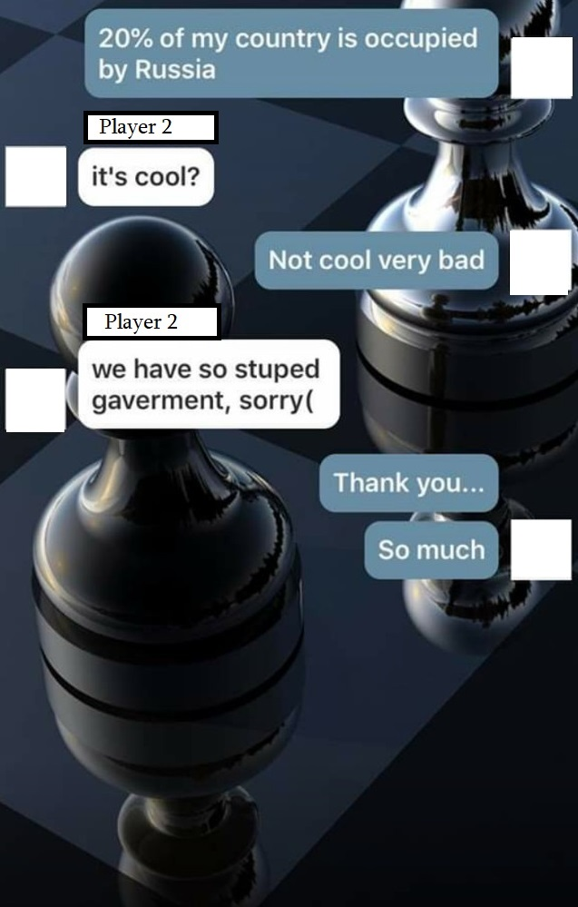
```
---

**Research question:**
- Is nationalism "a thing" in online platforms? 

--
  - Do participants response to international conflicts? <br> Behavioral responses, aggressiveness..
  
--
- Potentially problematic for the platform. (Organizer's POV)
  
--

<br>

- Broader: Do *residents* of countries get more hostile towards each other during a war?

--

<blockquote>Or, is war "just politics"?</blockquote>


---
# Obervational data?
- An RCT to answer this research question is infeasible.
- Data from individuals' interactions, while their countries are at war against each other?

--
- Online platforms?

--
- [chess.com](https://chess.com) operates 24/7! (the biggest online chess platform)
  - ~30,000 games happen each hour worldwide
  
---

# Conflicts

Uppsala Conflict Data Program (UCDP) Dyadic Dataset version 23.1

- Two "countries"
- "Substantial" military involvement (>1,000 number of soldiers actively engaged)
    - Excluding (for now) small "border clashes", e.g., between India and Pakistan, China...
- Since 2010 (that's when chess.com's data becomes available)

---

# Conflicts

Nagorno-Karabakh conflict between Azerbaijan and Armenia, Oct-Nov 2020

~5,000-10,000 casualties (mostly military)

```{r out.width='100%', fig.height=4, eval=require('leaflet')}
library(leaflet)
leaflet() %>% addTiles() %>% setView(43.1, 41.5, zoom = 5)
```

---

# Conflicts

Conflict between Ukraine and Russia, Feb 2022-cont.

\>500,000 casualties (military and civilian)

```{r out.width='100%', fig.height=4, eval=require('leaflet')}
library(leaflet)
leaflet() %>% addTiles() %>% setView(33.1, 51.5, zoom = 4)
```

---

# Conflicts

Conflict between Israel and Palestine, Oct 2023-cont.

\>75,000 casualties (military and civilian)

```{r out.width='100%', fig.height=4, eval=require('leaflet')}
library(leaflet)
leaflet() %>% addTiles() %>% setView(33.1, 33.5, zoom = 4)
```

---
# How to proceed?
- We web-scraped games played by Armenian, Azerbaijani, Ukrainian, Russian, Israeli, and Palestinian players before and after the start of conflict

  - Arm-Az: ~131,000 games with 20,000 during conflict
  - Ukr-Ru: ~1,161,000 games with 520,000 during conflict
  - Isr-Pal: ~62,000 games with 22,000 during conflict

- Outcomes we look at
  - Do they play more aggressively? Performance?
  - Mechanisms? Does the impact depend on who initiated the war, army size, public support?
   - Loss aversion, ie, prospect theory.

---

# Relevant Literature

- Conflicts alter perception and foster identity: Akerlof and Kranton (2000, QJE), Caceres-Delpiano et. al. (2021, JPubE), Gehring (2022, EJ), among others.
  - Dawson and Dabson (2010, JEconPsych): Referee bias by nationality
  - Depetris-Chauvin et. al. (2020, AER): Africa Cup of Nations & civil conflict

- Emotional responses to "news": 
  - Sharkey and Shen (2021, PNAS): Mass shootings in the U.S.
  - Guo and An (2022, JDevE): Terrorist attacks in Africa

- Performance under "stress": Cahlíková et. al. (2020, MS) etc.

---

```{r,echo=F, out.width="70%",fig.align="center",fig.cap="Chess.com interface"}
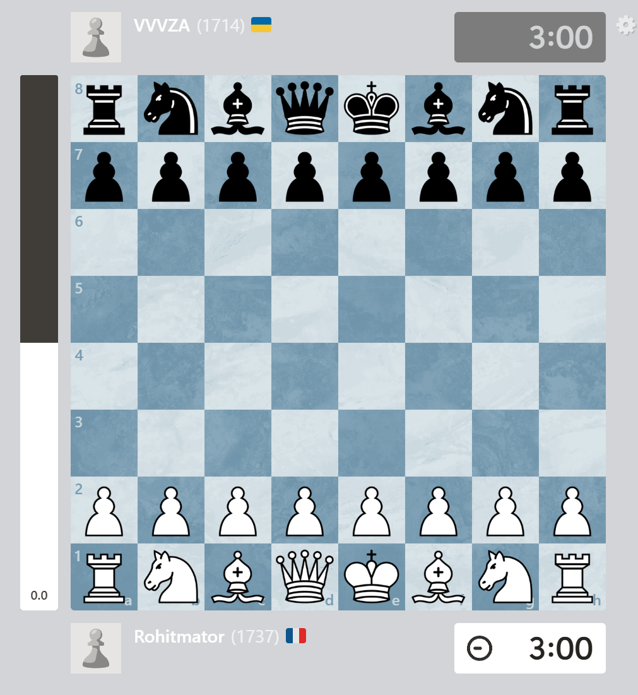
```


---
# Chess data
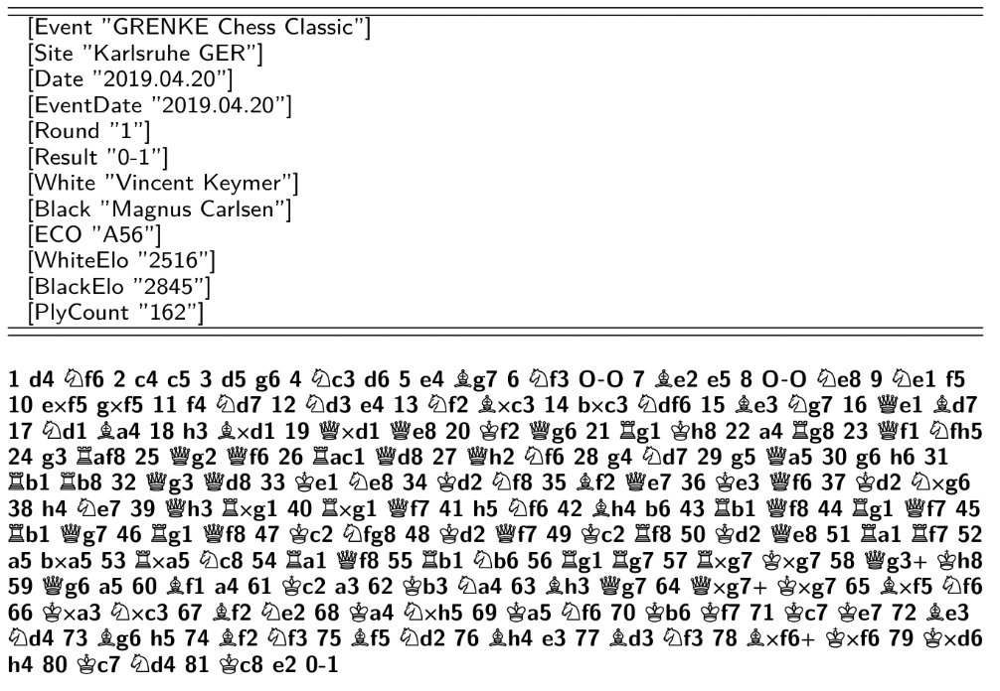

---

# Chess data

$\\[1cm]$
```{r,echo=F, out.width="40%",fig.align="center"}
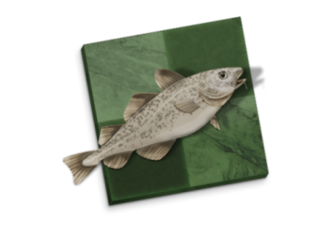
```
.center[.caption[**Figure:** Stockfish, estimated ELO (strength) as of 2026: 3651]]
---

# Chess data

$\\[1cm]$
```{r,echo=F, out.width="60%",fig.align="center"}
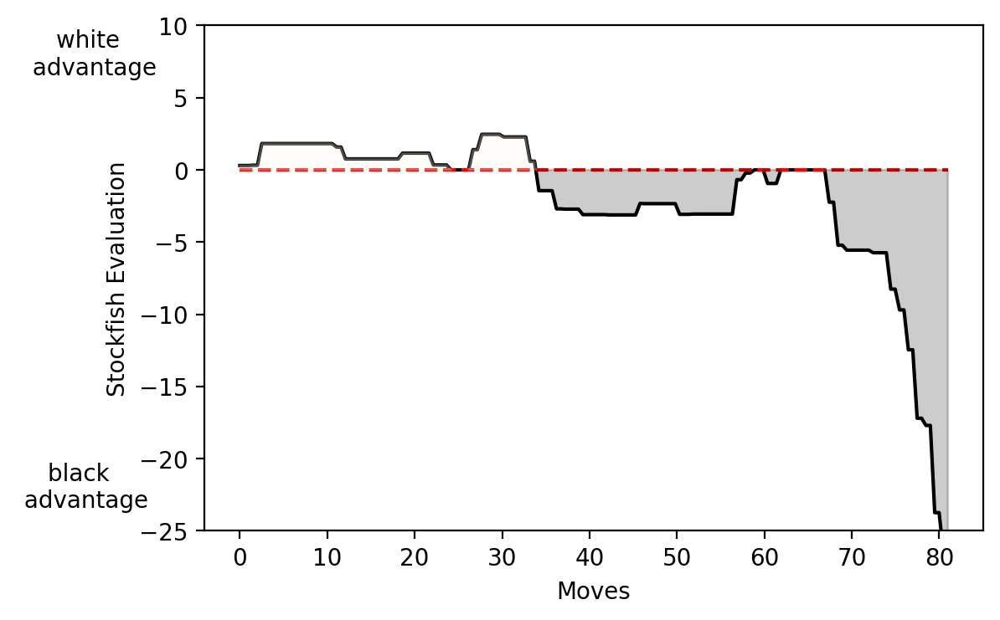
```
.center[.caption[**Figure:** Computer evaluation for Keymer vs. Carlsen (2019)]]


$$\overline{error_{ig}} = \frac{\sum\nolimits_{m=1}^{M} \left|C^{computer}_{igm} - C^{player}_{igm}\right|}{M}$$

---

# Chess data: Aggression
- Aggressiveness/"risk level" of a chess game? 
  - Gerdes and Gransmark (2010, Labour Econ); Dreber et. al. (2013, JEBO): opening strategy
  - Certain aggressive moves, eg, attacking the King or Queen more often
  - Decisiveness of games

- <b>Empirical Strategy:</b> "Differences in Differences"
  - Eg, Ukrainian vs. Russian players before/after conflict.
  - Their games against other non-conflict countries before/after conflict
- No variation in treatment timing: post same for everyone.
- How do users get matched? Random. BUT, can someone "refuse" to play? Yes. (biases results towards zero) BUT we do not see evidence of refusals.


---

# Chess data: Share of games

$\\[1cm]$
```{r,echo=F, out.width="100%",fig.align="center",fig.cap="Number of games played on chess.com"}
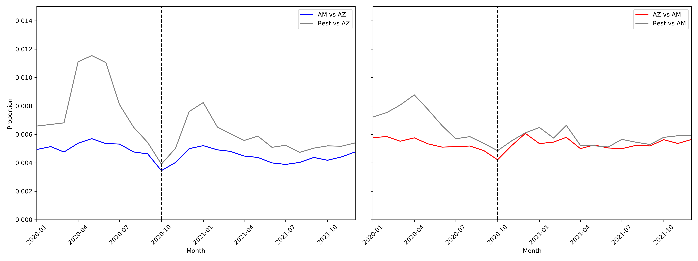
```

---

# Chess data: Share of games

$\\[1cm]$
```{r,echo=F, out.width="100%",fig.align="center",fig.cap="Number of games played on chess.com"}
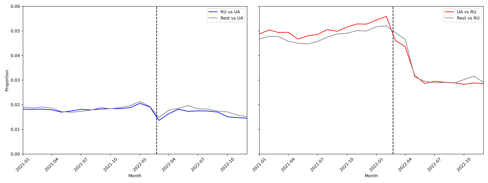
```

---

# Chess data: Share of games

$\\[1cm]$
```{r,echo=F, out.width="100%",fig.align="center",fig.cap="Number of games played on chess.com"}
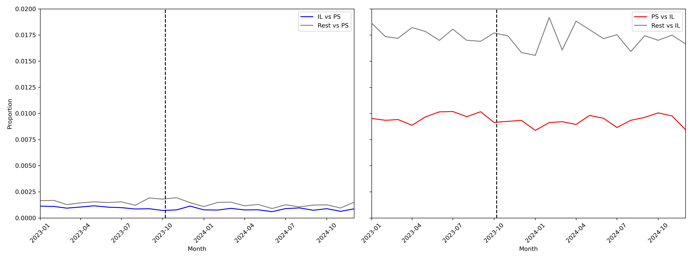
```

---

# Chess data: Diff in Diff

$Y_{ijg} = \gamma (H_{ij} \times \text{Post}_g) + \delta H_{ij} + \lambda \text{Post}_g + \pmb{X_{ijg}}'\pmb{\beta} + T_g + \alpha_i + u_{ijg}$

where $H_{ij}$ equals 1 if players $i$ and $j$ are from "hostile" country pairs; $\text{Post}_g$ equals 1 if game $g$ occurred after the conflict start date; $H_{ij} \times \text{Post}_g$ is the DiD interaction term with $\gamma$ the coefficient 
of interest. $T_g$ is yearmonth FEs; $\alpha_i$ is player FEs; $u_{ijg}$ is the idiosyncratic shock.

$Y_{ijg}$ includes performance e.g., mistakes, blunders; game outcomes e.g., decisive games vs. draws; and other aggressive moves.

- Mechanisms: "How the game ended": e.g., "agree" to a draw, "stalling" a game; game length (measured by total number of moves).
  

---
  
# Results

$\\[-.1cm]$
```{r,echo=F, out.width="85%",fig.align="center",fig.cap="Summary statistics"}
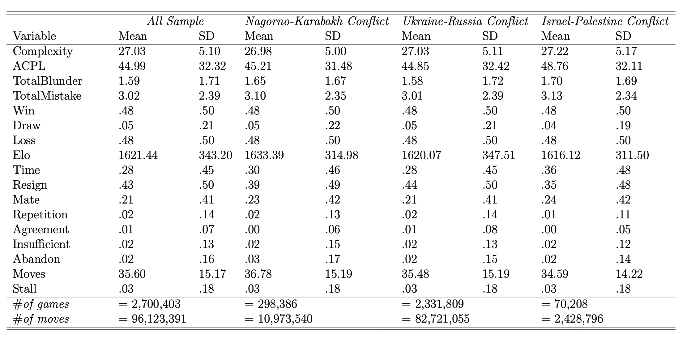
```

---

# Results
$\\[1cm]$

```{r,echo=F, out.width="70%",fig.align="center",fig.cap="Differences in Differences regression results: Aggression"}
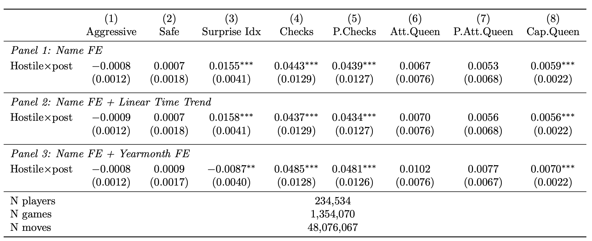
```


---

# Results


```{r,echo=F, out.width="70%",fig.align="center",fig.cap="Differences in Differences regression results: Performance"}
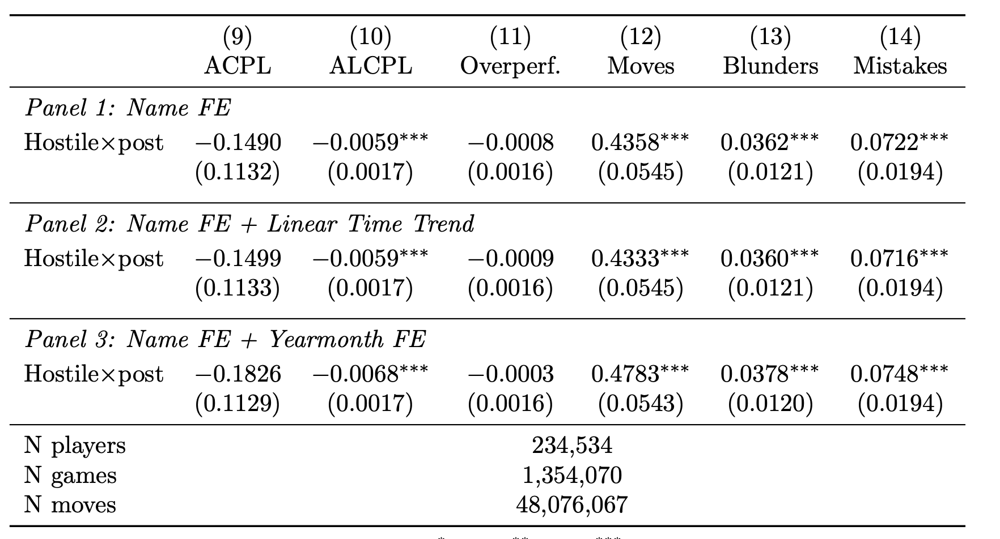
```


---

# Results


```{r,echo=F, out.width="90%",fig.align="center",fig.cap="Differences in Differences regression results: Game termination"}
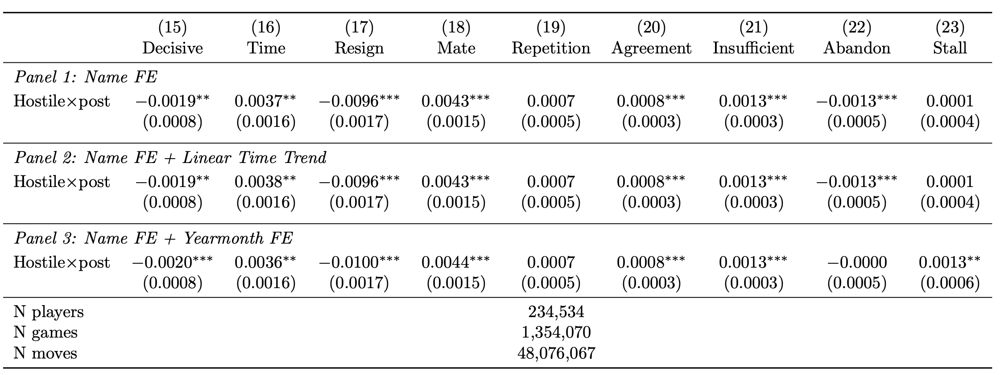
```

---

# Results
$\\[1cm]$

```{r,echo=F, out.width="70%",fig.align="center",fig.cap="Differences in Differences regression results: Aggression, AZ-AM"}
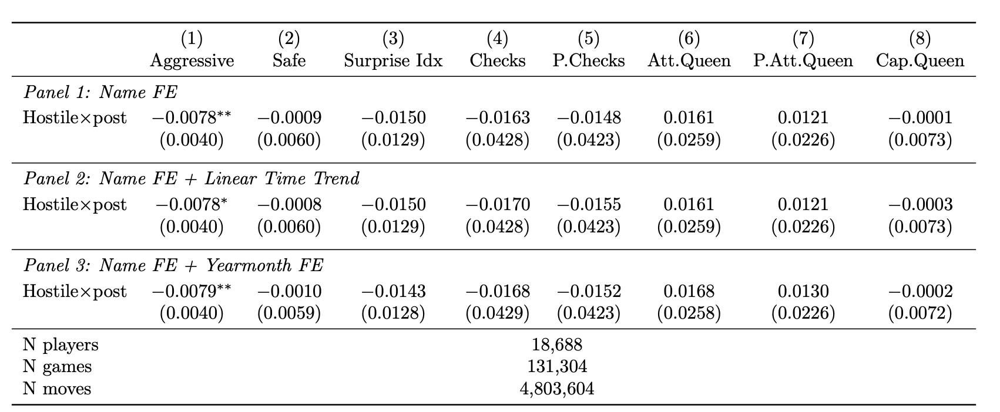
```


---

# Results


```{r,echo=F, out.width="70%",fig.align="center",fig.cap="Differences in Differences regression results: Performance, AZ-AM"}
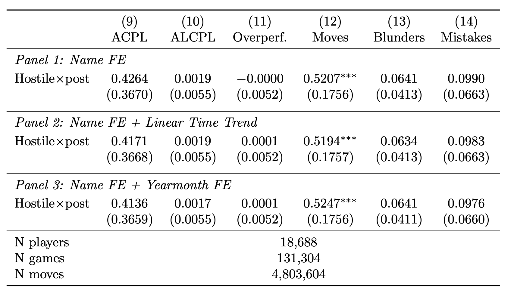
```


---

# Results


```{r,echo=F, out.width="90%",fig.align="center",fig.cap="Differences in Differences regression results: Game termination, AZ-AM"}
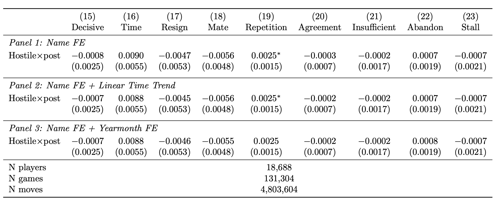
```

---

# Results
$\\[1cm]$

```{r,echo=F, out.width="70%",fig.align="center",fig.cap="Differences in Differences regression results: Aggression, UA-RU"}
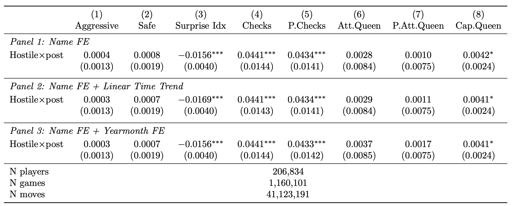
```


---

# Results


```{r,echo=F, out.width="70%",fig.align="center",fig.cap="Differences in Differences regression results: Performance, UA-RU"}
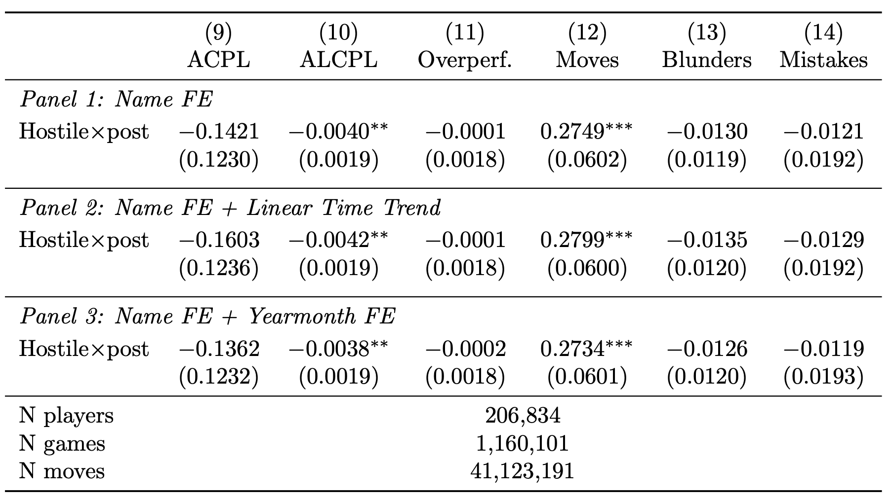
```


---

# Results


```{r,echo=F, out.width="90%",fig.align="center",fig.cap="Differences in Differences regression results: Game termination, UA-RU"}
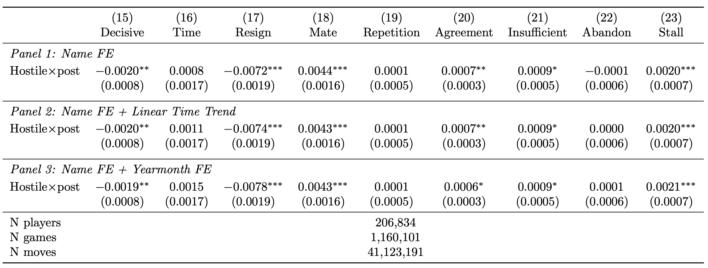
```

---

# Results
$\\[1cm]$

```{r,echo=F, out.width="70%",fig.align="center",fig.cap="Differences in Differences regression results: Aggression, IL-PS"}
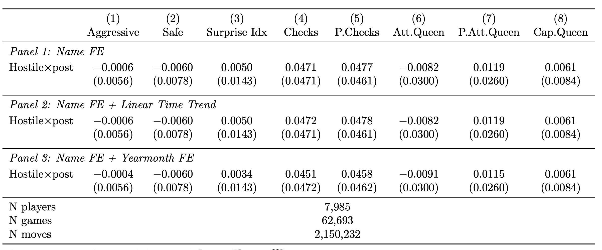
```


---

# Results


```{r,echo=F, out.width="70%",fig.align="center",fig.cap="Differences in Differences regression results: Performance, IL-PS"}
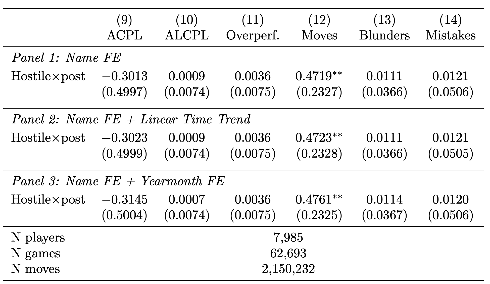
```


---

# Results


```{r,echo=F, out.width="90%",fig.align="center",fig.cap="Differences in Differences regression results: Game termination, IL-PS"}
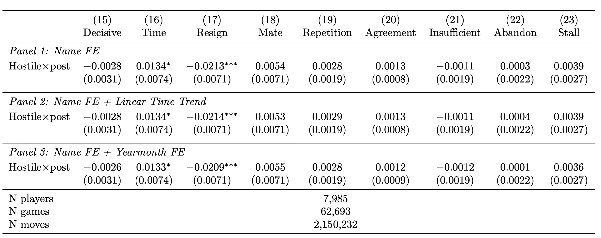
```

---

# Further results: suggestions?

- by rating quartiles
- time control
- side of conflict
- game stages


---

# Discussion

- Conflicts impacted the moves made by chess players
- Higher effort
  - More resiliency: longer games with less resigning and more mates.
- Mechanism: Risk aversion
  - Games end up more as draws.
- Heterogeneity TBD.
- A player retention-based structural model: necessary?

---

class: center, middle
count: false

# Thanks!

Slides created via the R package [**xaringan**](https://github.com/yihui/xaringan).

Backend support from [remark.js](https://remarkjs.com), [**knitr**](https://yihui.org/knitr/), and [R Markdown](https://rmarkdown.rstudio.com).

For questions and comments, you can reach me at
[**bilene@dickinson.edu**](bilene@dickinson.edu).

```{r,echo=F, eval=F, out.width="15%",fig.align="center"}

```

---
count: false
# Appendix

```{r,echo=F, out.width="80%",fig.align="center"}
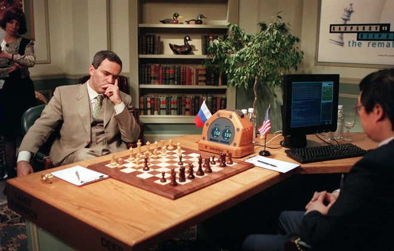
```
.center[.caption[**Figure:** Kasparov vs. Deep Blue, 1997]]

---
count: false
# Appendix
```{r,echo=F, out.width="90%",fig.align="center"}
knitr::include_graphics("shannon.png")
```
.center[.caption[**Figure:** Claude Shannon (1950) "Programming a Computer for Playing Chess"]]


---
count: false
<iframe src="https://lichess.org/analysis/8/6k1/3p1n1p/2pP1B1P/2P1pP1B/K1n5/8/8_w_-_-_0_1?color=white" style="width: 400px; height: 644px;" allowtransparency="true" frameborder="0"></iframe>


