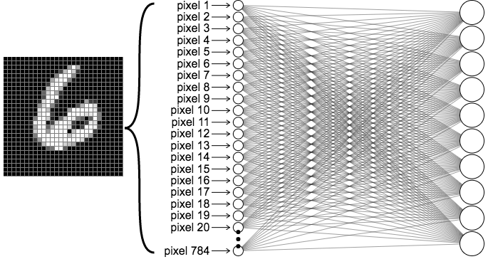
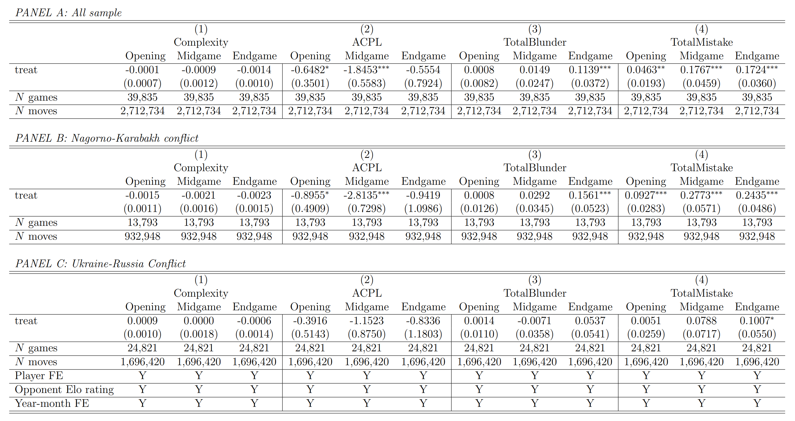

<style>
.caption {
  text-align: center;
  font-size: 14px;
}
</style>

<!--
.caption:before {
  content:"Figure: ";
  font-weight: bold;
} -->

```{r setup, include=FALSE}
options(htmltools.dir.version = FALSE)
```

```{r,echo=F}
#library(countdown)
#countdown(minutes = 0, seconds = 10, top = 2,left = 5, right = 5)
```


$\\[1cm]$
```{r,echo=F, out.width="50%",fig.align="center"}

```
---

**Research question:**
- Is nationalism "a thing" in online platforms? 

--
  - Do participants response to international conflicts? <br> Behavioral responses, aggressiveness..
  
--
- Potentially problematic for the platform. (Organizer's POV)
  
--

<br>

- Broader: Do *residents* of countries get more hostile towards each other during a war?

--

<blockquote>Or, is war "just politics"?</blockquote>


---
# Obervational data?
- An RCT to answer this research question is infeasible.
- Data from individuals' interactions, while their countries are at war against each other?

--
... sports?

--
- No international contest between two countries during a war
  - E.g., Russian soccer team was banned from competing in the 2022 World Cup in Qatar.
  
--
<br>
- Online platforms?

--
- [chess.com](https://chess.com) operates 24/7! (the biggest online chess platform)
  - ~30,000 games happen each hour worldwide
  
---

# Conflicts

Uppsala Conflict Data Program (UCDP) Dyadic Dataset version 23.1

- Two "countries"
- "Substantial" military involvement (>1,000 number of soldiers actively engaged)
    - Excluding (for now) small "border clashes", e.g., between India and Pakistan, China...
- Since 2010 (that's when chess.com's data becomes available)
  - Excluding (for now) the recent Israeli-Palestinian conflict

---

# Conflicts

Nagorno-Karabakh conflict between Azerbaijan and Armenia, Oct-Nov 2020

~5,000-10,000 casualties (mostly military)

```{r out.width='100%', fig.height=4, eval=require('leaflet')}
library(leaflet)
leaflet() %>% addTiles() %>% setView(43.1, 41.5, zoom = 5)
```

---

# Conflicts

Conflict between Ukraine and Russia, Feb 2022-cont.

\>500,000 casualties (military and civilian)

```{r out.width='100%', fig.height=4, eval=require('leaflet')}
library(leaflet)
leaflet() %>% addTiles() %>% setView(33.1, 51.5, zoom = 4)
```


---
# How to proceed?
- We web-scraped games played by Armenian, Azerbaijani, Ukrainian, and Russian players before and after the start of conflict

  - Arm-Az: ~261,000 games with 20,000 during conflict
  - Ukr-Ru: ~520,000 games with 120,000 during conflict
  
- More refined research question: Do people (chess players) reflect international conflict on their behavior?
- Outcomes we look at
  - How does each player perform? I.e., accuracy
  - Do they play more aggressively?
  - Mechanisms? Does the impact depend on who initiated the war, army size, public support?


---


```{r,echo=F, out.width="70%",fig.align="center",fig.cap="Chess.com interface"}

```
---
# Relevant Literature

- Conflicts alter perception and foster identity: Akerlof and Kranton (2000, QJE), Caceres-Delpiano et. al. (2021, JPubE), Gehring (2022, EJ), among others.
  - Dawson and Dabson (2010, JEconPsych): Referee bias by nationality
  - Depetris-Chauvin et. al. (2020, AER): Africa Cup of Nations & civil conflict

- Emotional responses to "news": 
  - Sharkey and Shen (2021, PNAS): Mass shootings in the U.S.
  - Guo and An (2022, JDevE): Terrorist attacks in Africa

- Performance under "stress": Cahlíková et. al. (2020, MS) etc.


---

# A simple model

$$U_{y, i, j}  = \alpha_y+\beta_{y, j} \quad y\in\{win, draw, loss\}$$

where $U_{y, i, j}$ is the utility player $i$ obtains from outcome $y$ against opponent $j$. Assume 

$$\begin{align}\label{eq:2}
    y =\begin{cases}
     win & \text{with probability } p(a) \\
     loss & \text{with probability } q(a) \\
     draw & \text{with probability } 1-p(a)-q(a)
    \end{cases}
\end{align}$$

$$\small\begin{align}\label{eq:5}
    &\max_{a} \mathbb{E}[U_{y, i, j}] \\
    &\max_{a} p(a)\big(\alpha_{win}+\beta_{win, j}\big) +\big(1-p(a)-q(a)\big)\big(\alpha_{draw}+\beta_{draw, j}\big)+q(a)\big(\alpha_{loss}+\beta_{loss, j}\big)  \nonumber
\end{align}$$

$\Rightarrow$ Aggression: More pleasure from beating a hostile opponent raises aggression, but an isolated increase in disutility from losing against a hostile opponent lowers aggression. (ambiguous net effect)

$\Rightarrow$ Performance: Improves with effort, but declines with mental pressure/stress with playing against an opponent from hostile nation. (ambiguous net effect)

Gandhi et al (2024, NBER): Beliefs that entertain (LA, spite, suspense/surprise)

---

# Chess data

$\\[1cm]$
```{r,echo=F, out.width="40%",fig.align="center"}

```
.center[.caption[**Figure:** A chess board]]

---
# Chess data


---

# Chess data

$\\[1cm]$
```{r,echo=F, out.width="40%",fig.align="center"}

```
.center[.caption[**Figure:** Stockfish, estimated ELO (strength) as of 2025: 3642]]
---

# Chess data

$\\[1cm]$
```{r,echo=F, out.width="60%",fig.align="center"}

```
.center[.caption[**Figure:** Computer evaluation for Keymer vs. Carlsen (2019)]]


$$\overline{error_{ig}} = \frac{\sum\nolimits_{m=1}^{M} \left|C^{computer}_{igm} - C^{player}_{igm}\right|}{M}$$

---

# Chess data: Risk & Board Complexity
- Aggressiveness/"risk level" of a chess game? 
  - Gerdes and Gransmark (2010, Labour Econ); Dreber et. al. (2013, JEBO): opening strategy
  - Bilen and Matros (2023, JEBO): neural-network
- Estimate probability of making a mistake on a given position
  - Most positions are unique, so can't look at historical data
  - **Solution:** Machine learning, e.g., a neural network that learns the "types" of positions and where mistakes happen the most
  - Trained on a separate sample with 25,000 games played in OTB tournaments, ~2 million moves
  - Use the model to estimate the complexity of games in the conflict sample

```{r,echo=F, out.width="55%",fig.align="center"}

```

---

# Chess data: Board Complexity

$\\[1cm]$
```{r,echo=F, out.width="70%",fig.align="center"}

```

---

# Chess data: Board Complexity

$\\[1cm]$
```{r,echo=F, out.width="80%",fig.align="center",fig.cap="Histograms for ACPL (actual mistakes) vs. Complexity (estimated mistakes) mean ACPL = 72, estimated mean ACPL = 27"}

```

---

# Chess data: Board Complexity

$\\[1cm]$
```{r,echo=F, out.width="60%",fig.align="center",fig.cap="Scatterplot of ACPL (actual mistakes) against Complexity (estimated mistakes) slope = 2.32 with SE=.03"}
knitr::include_graphics("image6.png")
```

---

# Empirical Strategy

- "Differences in Differences"
  - E.g., Ukrainian vs. Russian players before and after the conflict.
  - Their games against other non-conflict countries before and after the conflict
- No variation in treatment timing: post same for everyone.
- How do users get matched? Random. BUT, can someone "refuse" to play? Yes. Sample is biased towards zero.


$Y_{ijg}=\gamma H_{ijg}+\pmb{X_{ijg}}'\pmb{\beta}+T_g+\alpha_i+u_{ijg}$

where $H_{ijg}$ equals 1 if a game $g$ between player $i$ and player $j$ happened between players of "treated" countries post the conflict starting date. $T_g$ is yearmonth FEs; $\alpha_i$ is player FEs. $u_{ijg}$ is the idiosyncratic shock.

$Y_{ijg}$ includes performance e.g., mistakes, blunders; game outcomes e.g., win, loss; and the choice of game complexity as proxy for aggression.
  - Secondary outcomes: "How the game ended": e.g., "agree" to a draw, "stalling" a game; game length (measured by total number of moves).
  
---
  
# Results

$\\[-.1cm]$
```{r,echo=F, out.width="85%",fig.align="center",fig.cap="Summary statistics"}

```


---
  


# Results

$\\[1cm]$
```{r,echo=F, out.width="100%",fig.align="center",fig.cap="Number of games played on chess.com"}

```
---

# Results

$\\[1cm]$
```{r,echo=F, out.width="100%",fig.align="center",fig.cap="Number of games played on chess.com"}

```
---

# Results


```{r,echo=F, out.width="70%",fig.align="center",fig.cap="Differences in Differences regression results: Aggression and performance"}

```


---

# Results


```{r,echo=F, out.width="70%",fig.align="center",fig.cap="Differences in Differences regression results: Game scores"}

```


---

# Results


```{r,echo=F, out.width="90%",fig.align="center",fig.cap="Differences in Differences regression results: Game termination"}

```

---

# Results


```{r,echo=F, out.width="55%",fig.align="center",fig.cap="Differences in Differences regression results: Results by Elo rating"}

```

---

# Results


```{r,echo=F, out.width="50%",fig.align="center",fig.cap="Differences in Differences regression results: Results by time control"}

```

---

# Results


```{r,echo=F, out.width="120%",fig.align="center",fig.cap="Differences in Differences regression results: Results by stages of the game"}

```


---

# Takeaways

- Conflicts impacted the moves made by chess players
  - Evidence for aggressive moves played by lower ranked players.
- Higher effort
  - More resiliency: longer games with less resigning and more mates.
  - Quality improvements come from the highest rating quartile.
- Risk aversion
  - Games end up more as draws.
- About uniform response from both sides.
- Player retention structural model to come.

---

class: center, middle
count: false

# Thanks!

Slides created via the R package [**xaringan**](https://github.com/yihui/xaringan).

Backend support from [remark.js](https://remarkjs.com), [**knitr**](https://yihui.org/knitr/), and [R Markdown](https://rmarkdown.rstudio.com).

For questions and comments, you can reach me at
[**bilene@dickinson.edu**](bilene@dickinson.edu).

```{r,echo=F, eval=F, out.width="15%",fig.align="center"}

```

---
count: false
# Appendix

```{r,echo=F, out.width="80%",fig.align="center"}

```
.center[.caption[**Figure:** Kasparov vs. Deep Blue, 1997]]

---
count: false
# Appendix
```{r,echo=F, out.width="90%",fig.align="center"}
knitr::include_graphics("shannon.png")
```
.center[.caption[**Figure:** Claude Shannon (1950) "Programming a Computer for Playing Chess"]]

---
count: false
# Results
```{r,echo=F, out.width="50%",fig.align="center",fig.cap="Differences in Differences regression results: Results by the side of the conflict"}

```

---
count: false
<iframe src="https://lichess.org/analysis/8/6k1/3p1n1p/2pP1B1P/2P1pP1B/K1n5/8/8_w_-_-_0_1?color=white" style="width: 400px; height: 644px;" allowtransparency="true" frameborder="0"></iframe>


