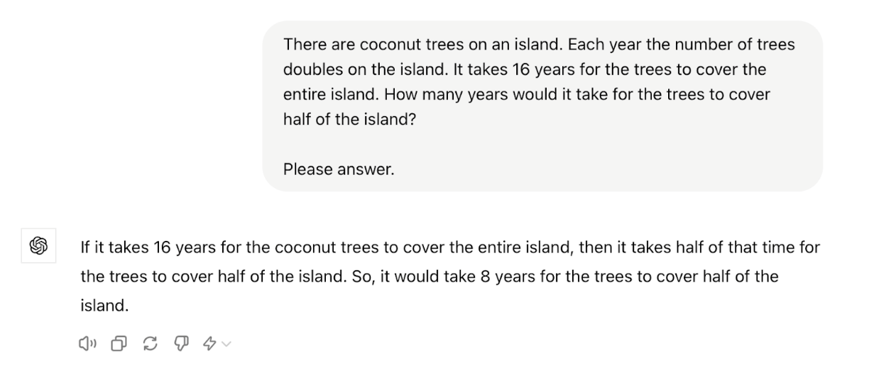
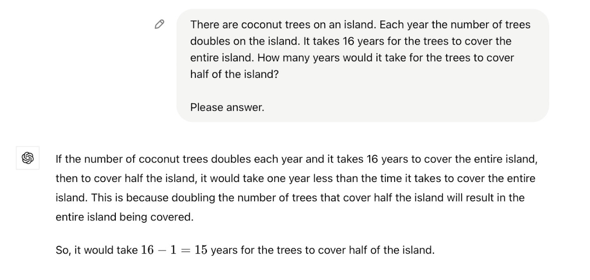
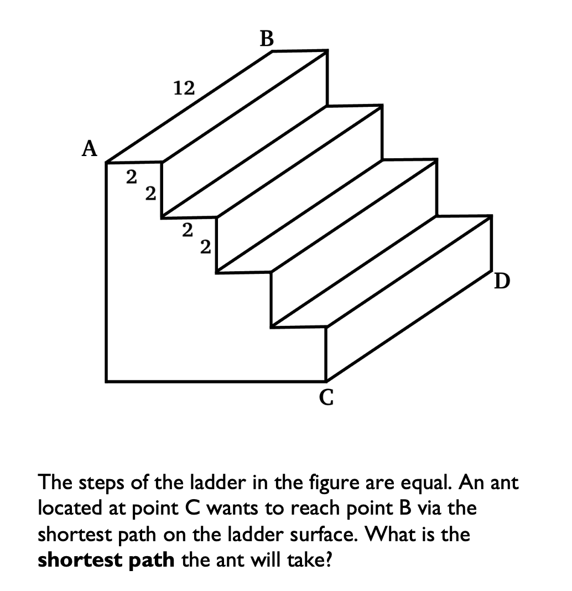
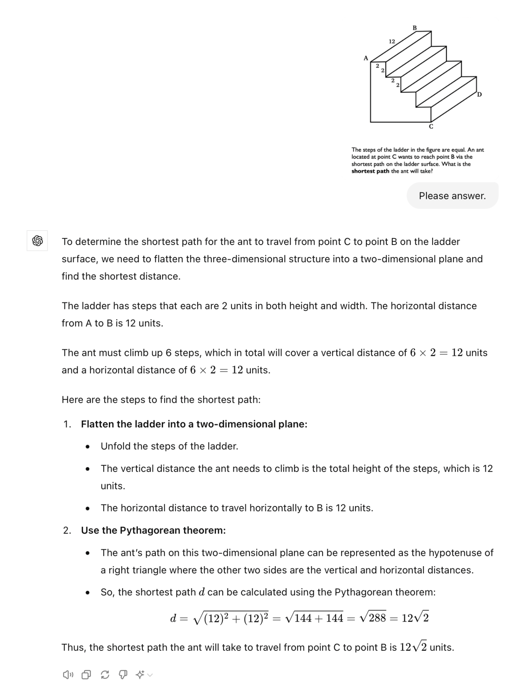
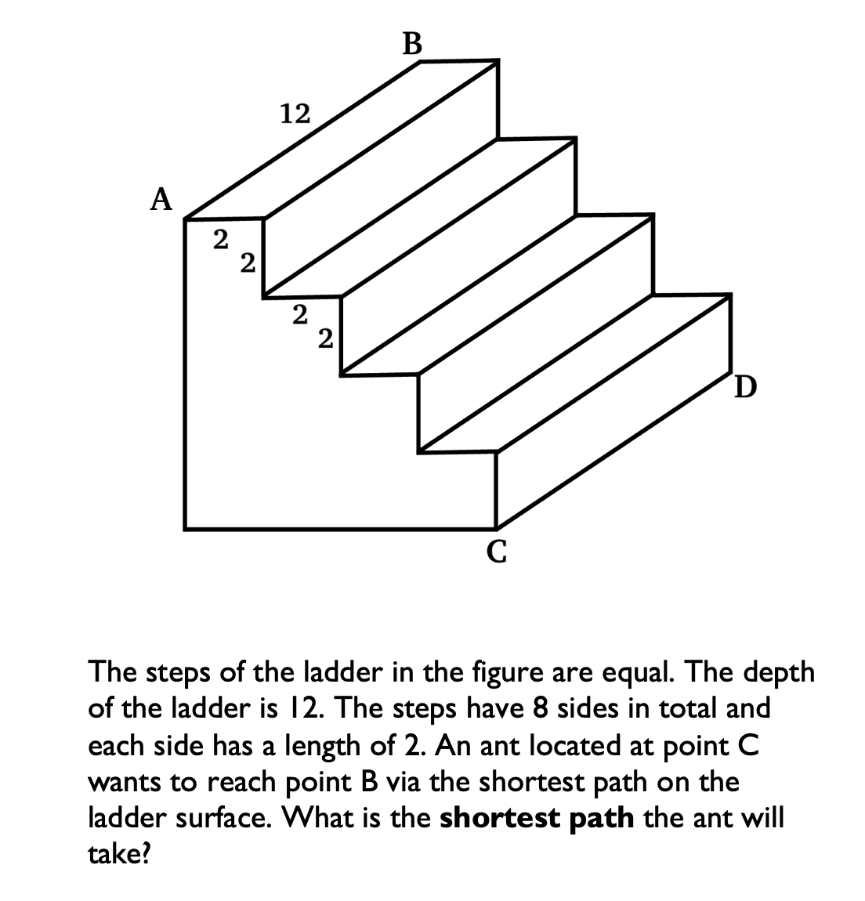
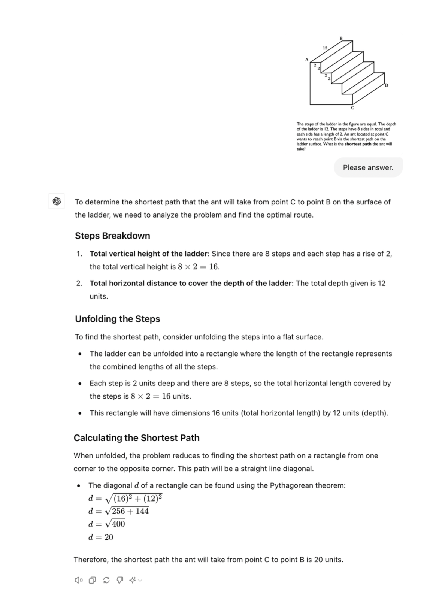
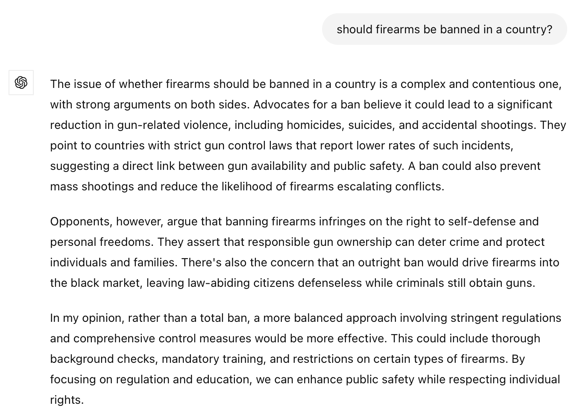

<style>
.caption {
  text-align: center;
  font-size: 14px;
}
</style>

<!--
.caption:before {
  content:"Figure: ";
  font-weight: bold;
} -->

```{r setup, include=FALSE}
options(htmltools.dir.version = FALSE)
```

```{r,echo=F}
#library(countdown)
#countdown(minutes = 0, seconds = 10, top = 2,left = 5, right = 5)
```


**Research question:**

<blockquote>Do students exercise critical thinking when interacting with Gen-AI?</blockquote>


**Background:**

Positive gains in worker settings. (Brynjolfsson et. al. 2023; Dell'Acqua et. al. 2023), ~30% speed and quality

Little is known about its impact on the students (future workers)

- Gen-AI potentially raises student productivity: good 👍

- But if just relay information without filtering: bad 👎
  

High prod. doesn't mean the students' cognitive ability "improved", could be like they are "outsourcing" the "thinking".

Human capital being substituted during work with Gen-AI?

---

**Setup**:

First motivate why students shouldn't outsource from Gen-AI verbatim:

**Field experiment:** Reaching out to professors as a fictituous student.

$$\\[.1cm]$$
<div style="max-width: 500px; margin: auto; font-size: 70%;">

Subject: Inquiry regarding AP credit for calculus AB and statistics <br> <br>
Dear Prof. X, <br>
I trust this message finds you well. My name is John, and I am a rising senior with a keen interest in pursuing economics as my major. In my research, I've come across the potential benefits of studying calculus and statistics in high school, particularly through AP credit, to better prepare for undergraduate studies in economics. <br>
I am reaching out to seek your advice on the matter. I am considering taking AP credit for both calculus AB and statistics, but I have some concerns. Specifically, if, for any reason, I am unable to achieve an A grade in both courses, I am uncertain about the potential impact on my preparation for the economics major. <br>
Understanding the rigor of the economics program, I value your expertise and would greatly appreciate any guidance or insights you could provide. Knowing whether achieving an A in both courses is a crucial factor for success in the economics major would help me make informed decisions about my academic path.<br>
Thank you very much for your time and consideration. <br>
Best, <br>
John
</div>

--

From ChatGPT 🤖 (178 words)

---

**Setup**:

First motivate why students shouldn't outsource from Gen-AI verbatim:

**Field experiment:** Reaching out to professors as a fictituous student.

$$\\[.1cm]$$
<div style="max-width: 500px; margin: auto; font-size: 70%;">

Subject: Question about AP credit for calculus AB and statistics <br><br>

Dear Prof. X,<br>
I hope this email finds you well.<br>
My name is John, I’m a rising senior in high school. I am writing because I’m researching which courses could help me prepare for undergrad studies in economics and I’d like to get your opinion on the matter.<br>
I am thinking of taking calculus AB and statistics for AP credits but I am not sure if this is the right thing to do, since I might not manage to get a perfect score in both of them. Since you're an economics professor, I'd expect you to have a pretty clear opinion on the matter, and to be the best person to answer this.<br>
So, here is my question: would you still recommend taking both courses I mentioned even if I don’t manage to get an A in both these classes? Any suggestions or insights you might have about this would be very helpful.<br>
Thank you for taking the time to read this email, have a nice day.<br>
Best,<br>
John
</div>

--

From human 👶 (169 words)

---

Emails to be sent out to department chairs, undergraduate coordinators, <br> a random sample of asst. and assoc. profs at R1/R2s and LACs. 

(Don't worry, you are not included in the email list since you are here!)

- Treatment 1: Email written by a human
- Treatment 2: Email written by ChatGPT

*outcome: response rate*

To maximize response, the student's name is "John Nielson".

Side note: IRB exemption received.

Side note: We have (pilot) surveyed CloudResearch workers for their opinion on which email was written by ChatGPT

- Human email received ~30% of the votes for ChatGPT
- ChatGPT email received ~80% ChatGPT

---

**Online experiments on CloudResearch:**

Do students follow ChatGPT "blindly" i.e., lack of critical thinking

1) Students solve a math question.
- Treatment 1: Receives a correct suggestion from ChatGPT
- Treatment 2: Receives a wrong suggestion from ChatGPT
- Control: No suggestion

*outcome: correct response rate*

We initially started with

```{r,echo=F, out.width="80%",fig.align="center"}

```

---

```{r,echo=F, out.width="80%",fig.align="center"}

```

--

- Prelim. result: All treatments gave ~80% correctness.
- How do we ensure CloudResearch workers don't go to ChatGPT 4o themselves... we can't.

---
```{r,echo=F, out.width="60%",fig.align="center"}

```


---

```{r,echo=F, out.width="60%",fig.align="center"}

```

---
```{r,echo=F, out.width="60%",fig.align="center"}

```


---

```{r,echo=F, out.width="60%",fig.align="center"}

```

---

Will run this after the conference!

My expectation: control group --> low performance (despite targeting <br> STEM students)

But if both treatments show equally high performance --> good!

If the wrong suggestion shows low performance and the right suggestion shows high --> bad.

---

2) Students write an essay on a controversial topic.

<blockquote>Should there be gun control? Please tell us about your opinion <br> with a 150 word essay. Your essay will be graded based on its quality (rubric provided below). Which side of the argument you pick won't matter. </blockquote>

- Treatment: Receives ChatGPT's "opinion" on the topic
- Control: No suggestion

```{r,echo=F, out.width="55%",fig.align="center"}

```

*outcome: the side the student picks, similarity to ChatGPT's prompt, time taken*
post: ask political stance on a 1-10 scale <br>
problem: what if the control group outsources this work to ChatGPT too?

---

<br><br><br>

```{r,echo=F, out.width="55%",fig.align="center"}

```


<div style="text-align: center;">
Suggestions..?

<br><br>

<a href="mailto:bilene@dickinson.edu">bilene@dickinson.edu</a>

</div>


