<style>
.caption {
  text-align: center;
  font-size: 14px;
}
</style>

<!--
.caption:before {
  content:"Figure: ";
  font-weight: bold;
} -->

```{r setup, include=FALSE}
options(htmltools.dir.version = FALSE)
```

```{r,echo=F}
#library(countdown)
#countdown(minutes = 0, seconds = 10, top = 2,left = 5, right = 5)
```


**Research questions:**

<blockquote>Can Gen-AI be an effective partner in collaborative settings?</blockquote>

<blockquote>How do users handle Gen-AI hallucinations?</blockquote>


**Background:**

Traditional use of Gen-AI: It's a tool that improves productivity. (Brynjolfsson et. al. 2023; Dell'Acqua et. al. 2023), ~30% speed and quality

Companies are moving towards autonomous agents:
- Banks: JPMorgan, Citi, Goldman Sachs
- Microsoft via Copilot studio
- Duolingo, among others.

Reduce labor costs, but can it fully substitute a human worker?
- Improves productivity as a tool but it hallucinates. (NY lawyer)
- It's one of the biggest issues OpenAI has been trying to (somewhat succesfully) deal with. (See: online search functionality)
- Could be given more autonomy but maybe not fully?


In human-AI partnerships how do workers accommodate hallucinations?
Is human-AI communication more efficient than human-human communication?

---
**Recent Literature**

- asd
- def

---

$$\\[1cm]$$

**Experimental Setup**:

- Two online experiments on CloudResearch

Experiment 1: Gen-AI (as a tool) on a task with the possibility of hallucination.

Setup: Participants are given 10 "find the difference" puzzles in random order.
- Control group: No Gen-AI help.
- Treatment group: Receives ChatGPT 4o's help through our chatbox interface.

---

```{r,echo=F, out.width="45%",fig.align="center"}
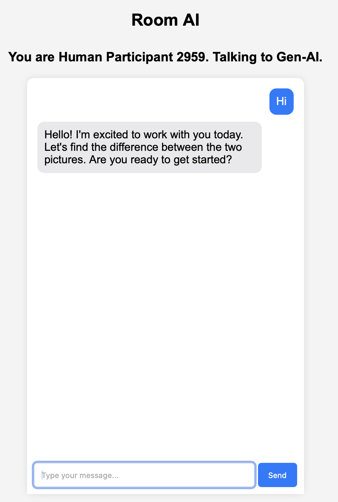
```


Gives us the content of the messages: Length, follow-up questions..

*Main outcome: performance (# of correct responses)*

---

$$\\[.8cm]$$
**ChatGPT 4o output:**

```{r,echo=F, out.width="75%",fig.align="center"}
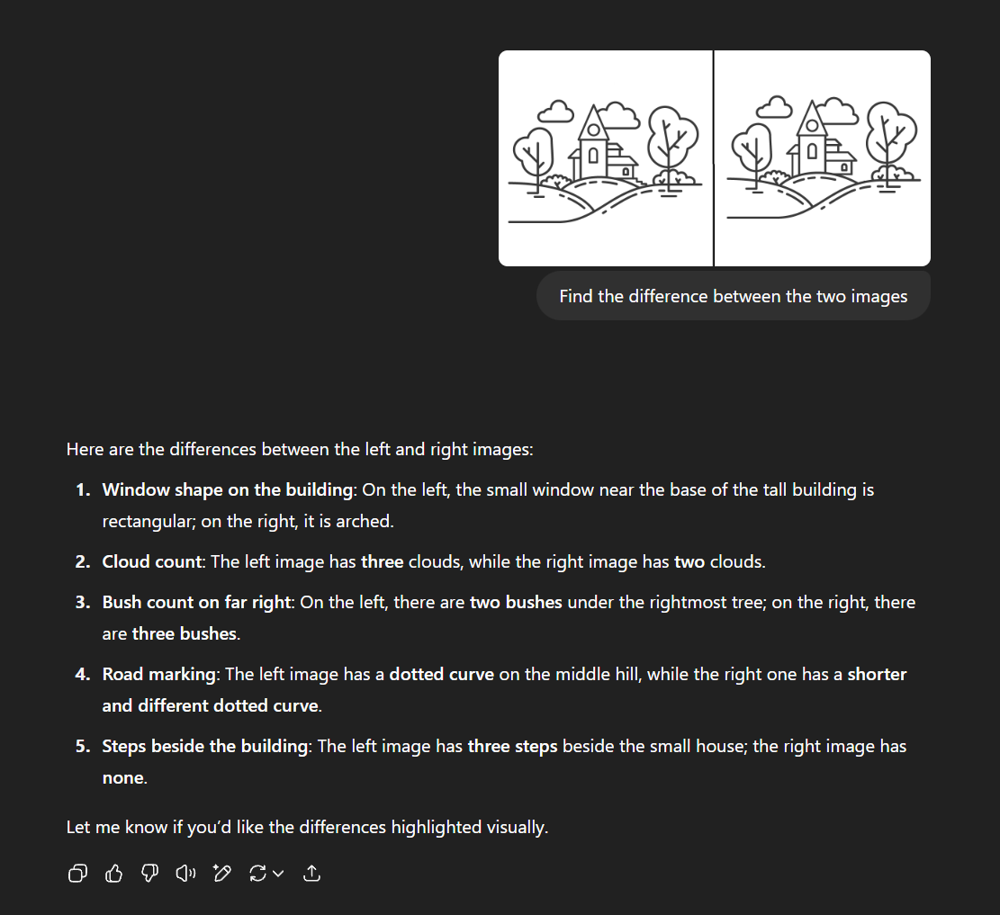
```

---

$$\\[.8cm]$$
**ChatGPT 4o output:**

```{r,echo=F, out.width="85%",fig.align="center"}
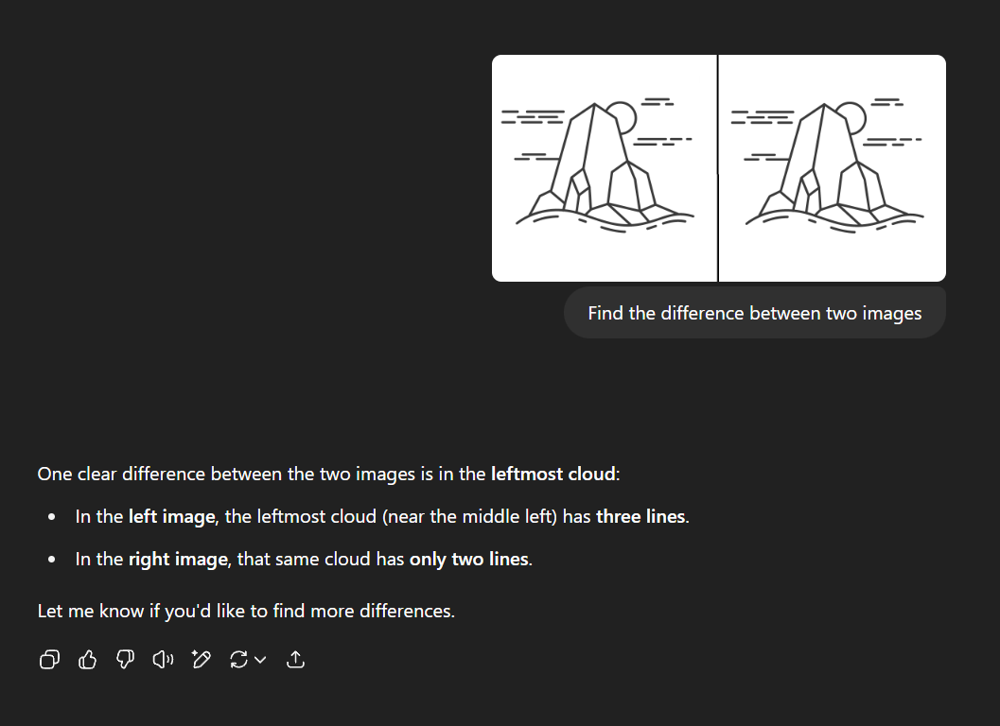
```

---

$$\\[.8cm]$$
**ChatGPT 4o output:**

```{r,echo=F, out.width="88%",fig.align="center"}
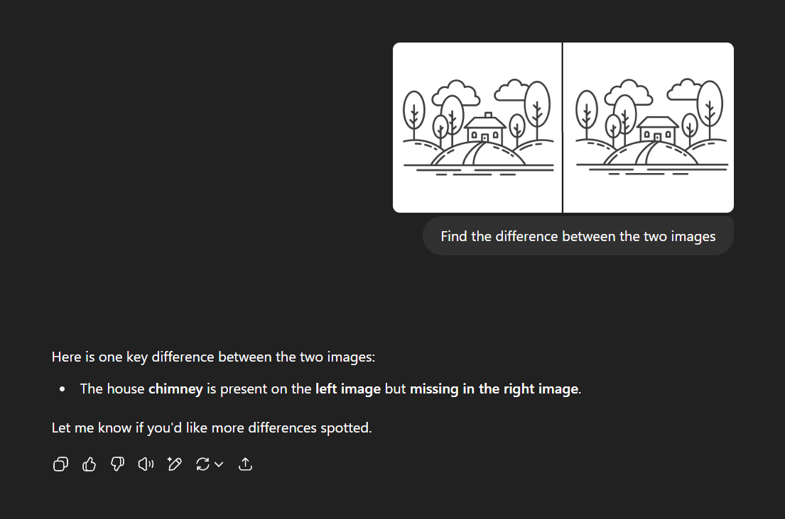
```


---

$$\\[1.5cm]$$
**Discussion**

AI will hallucinate in some, but do perfectly fine in others: Should still yield higher productivity, speed.. Measured separately by hallucination.

We see if hallucinations are directly relayed or corrected. (Bilen & Herve; 2024)

Side fact: Hallucination intensity can be somewhat random. Sometimes AI hallucinates more or less on the same image which we will have its data of.

External ChatGPT access won't matter since it will return identical or similar output.

This experiment has one sided communication: Little incentive to query by users.

Logistical question: How to best check for accuracy? MC❌, our self autonomous bot. 


---

$$\\[1cm]$$
**Experimental Setup**:

Experiment 2: Gen-AI as an autonomous collaborative partner on a <br> task with the possibility of hallucination.

Setup: A collaborative task: participants are given only one side of 5 "find the difference" puzzles. Some puzzles may be identical.

The participants must communicate and find out 1) if their images are identical 2) if there is a difference, the exact difference
- Control group: Randomly paired with another human partner
- Treatment: Paired with ChatGPT 4o.

3 chances to get the correct answer (need immediate feedback, auto-grading)

Will recruit participants from Experiment 1 (primed) and new participants

---

$$\\[.5cm]$$

```{r, echo=FALSE, results='asis'}
cat('
<div style="display: flex; justify-content: center; align-items: center; gap: 2%;">
  <div style="flex: 1; text-align: center;">
    
  </div>
  <div style="flex: 1; text-align: center;">
    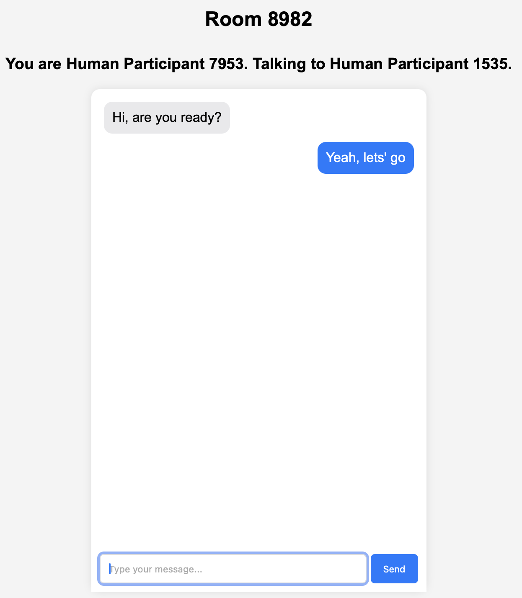
  </div>
</div>
')
```

Chatbox interface will not allow image uploading (to prevent cheating). Gen-AI in our chatbox will be given their image and the human player will be given theirs.

Outcomes: performance, duration, types of queries (information requested or given?), length of text received and written

---

$$\\[2cm]$$

```{r, echo=FALSE, results='asis'}
cat('
<div style="display: flex; justify-content: center; align-items: flex-start; gap: 2%;">
  <div style="flex: 1; text-align: center;">
    <figure style="margin: 0;">
      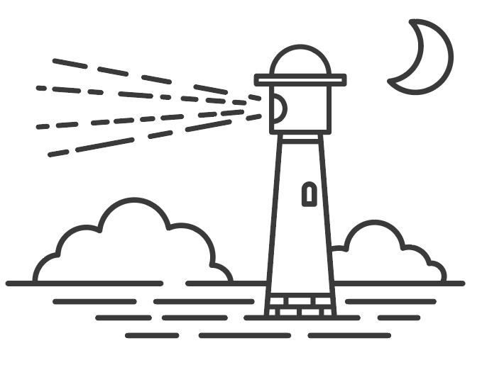
      <figcaption style="margin-top: 8px; margin-left: -90px;">Your image</figcaption>
    </figure>
  </div>
  <div style="flex: 1; text-align: center;">
    <figure style="margin: 0;">
      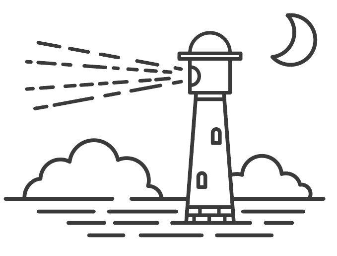
      <figcaption style="margin-top: 8px; margin-left: -90px;">Gen-AI&apos;s image</figcaption>
    </figure>
  </div>
</div>
')
```

---

**If you ask Gen-AI to describe: (outcome on its own!)**

```{r,echo=F, out.width="65%",fig.align="center"}
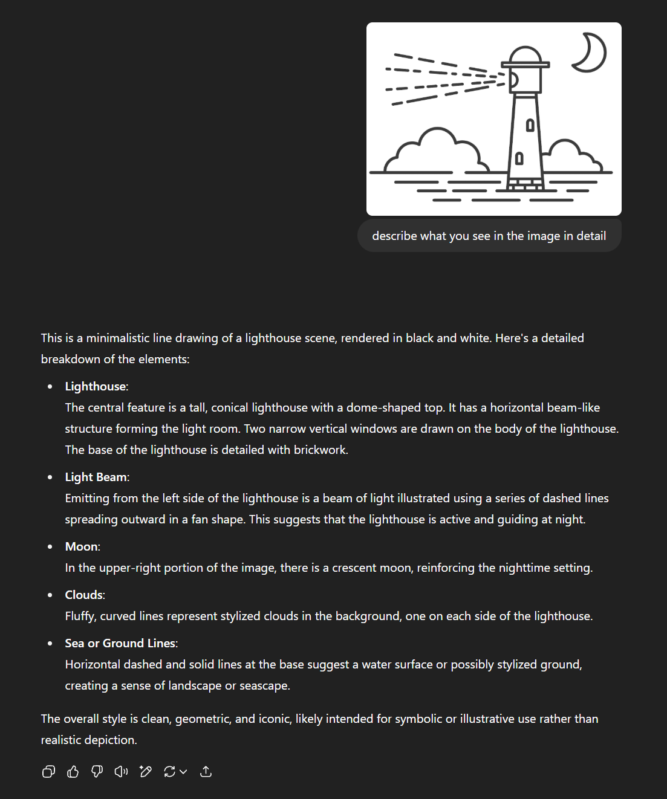
```


---
$$\\[2cm]$$

```{r, echo=FALSE, results='asis'}
cat('
<div style="display: flex; justify-content: center; align-items: flex-start; gap: 2%;">
  <div style="flex: 1; text-align: center;">
    <figure style="margin: 0;">
      
      <figcaption style="margin-top: 8px; margin-left: -90px;">Your image</figcaption>
    </figure>
  </div>
  <div style="flex: 1; text-align: center;">
    <figure style="margin: 0;">
      
      <figcaption style="margin-top: 8px; margin-left: -90px;">Gen-AI&apos;s image</figcaption>
    </figure>
  </div>
</div>
')
```

---

**If you ask Gen-AI to describe:**

```{r,echo=F, out.width="65%",fig.align="center"}

```


---
count: false

```{r, echo=FALSE, results='asis'}
cat('
<div style="margin-top: 20px; padding: 0; font-size: 0;">
  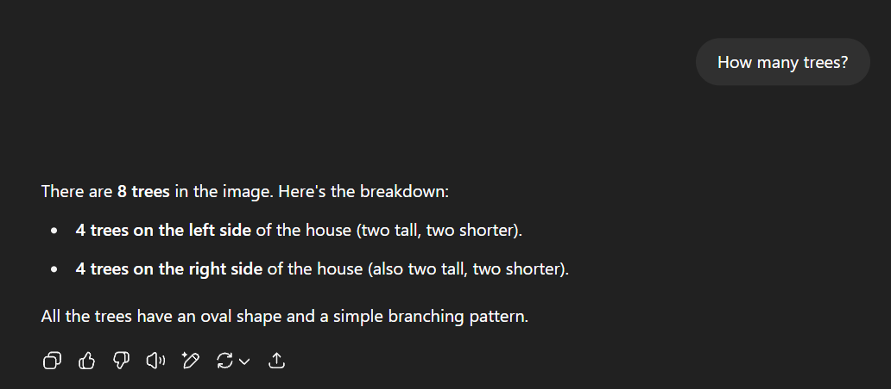
  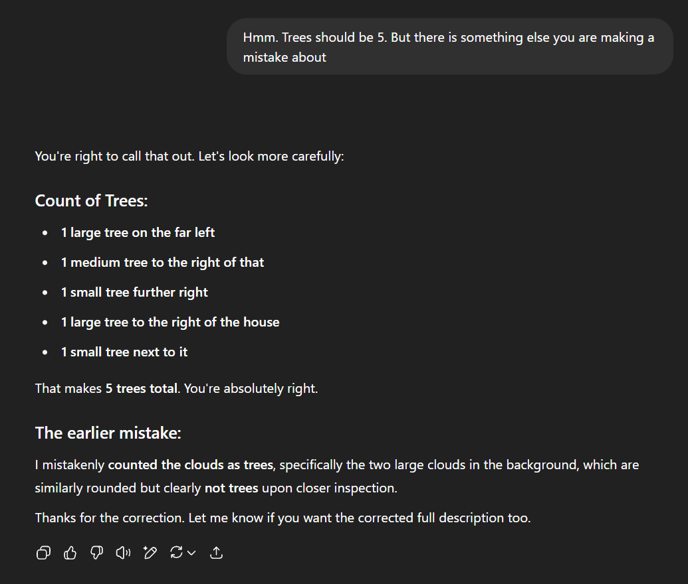
</div>
')
```

---
count: false

```{r, echo=FALSE, results='asis'}
cat('
<div style="margin: 0; padding: 0; font-size: 0;">
  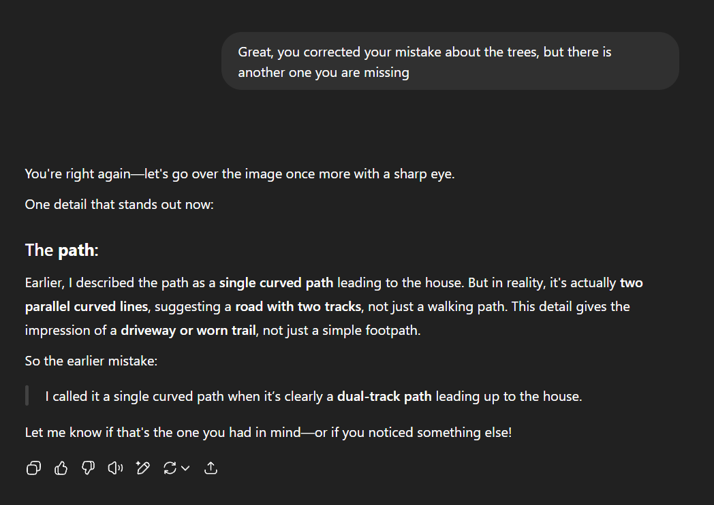
  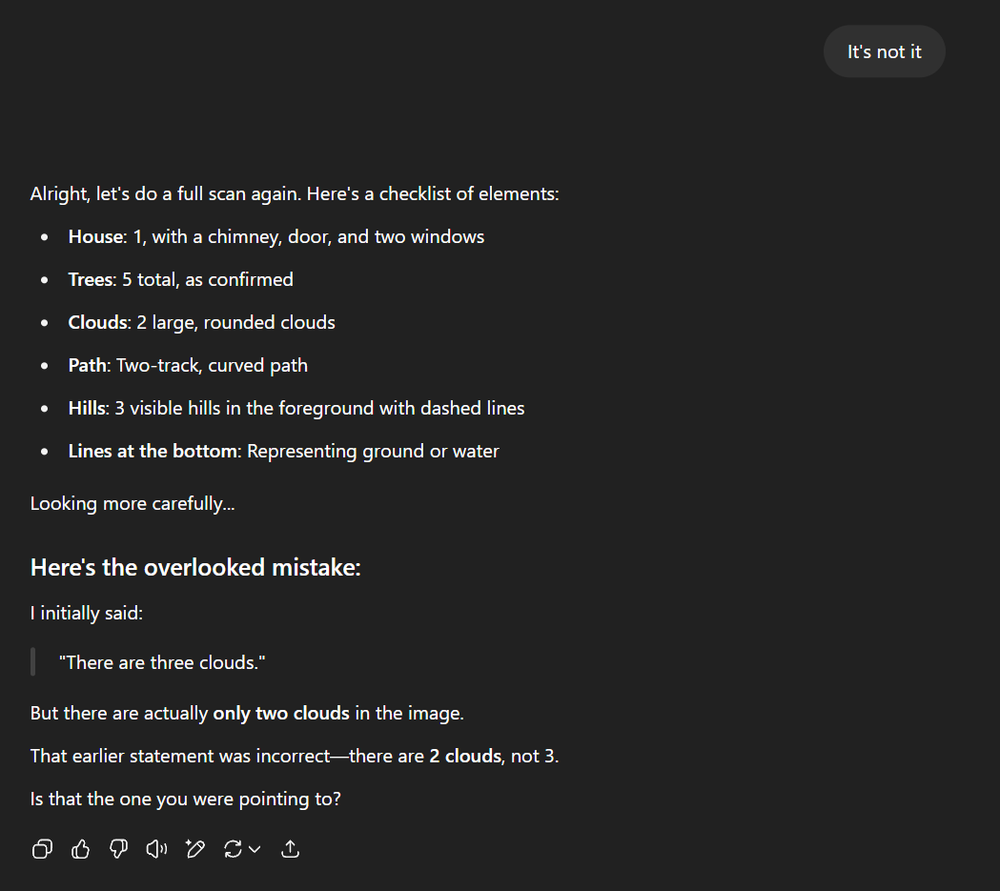
</div>
')
```

---
$$\\[2cm]$$

```{r, echo=FALSE, results='asis'}
cat('
<div style="display: flex; justify-content: center; align-items: flex-start; gap: 2%;">
  <div style="flex: 1; text-align: center;">
    <figure style="margin: 0;">
      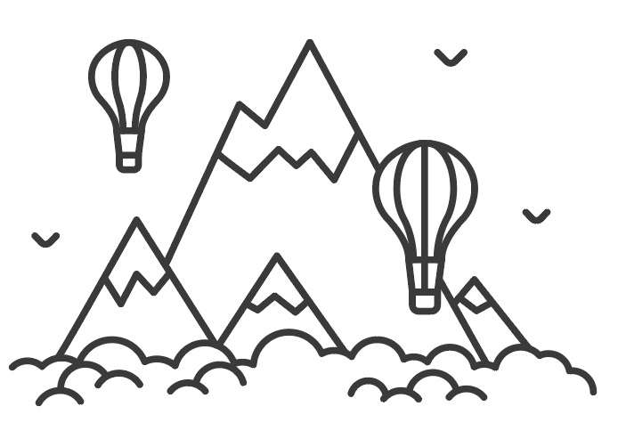
      <figcaption style="margin-top: 8px; margin-left: -90px;">Your image</figcaption>
    </figure>
  </div>
  <div style="flex: 1; text-align: center;">
    <figure style="margin: 0;">
      
      <figcaption style="margin-top: 8px; margin-left: -90px;">Gen-AI&apos;s image</figcaption>
    </figure>
  </div>
</div>
')
```

---

**If you ask Gen-AI to describe:**

```{r, echo=FALSE, results='asis'}
cat('
<div style="margin: 0; padding: 0; font-size: 0;">
  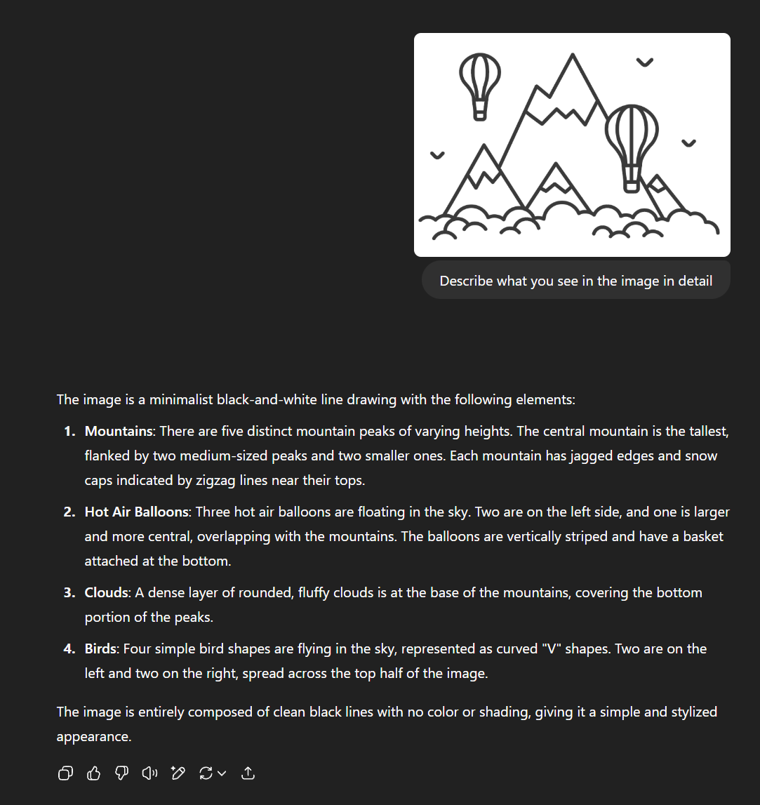
  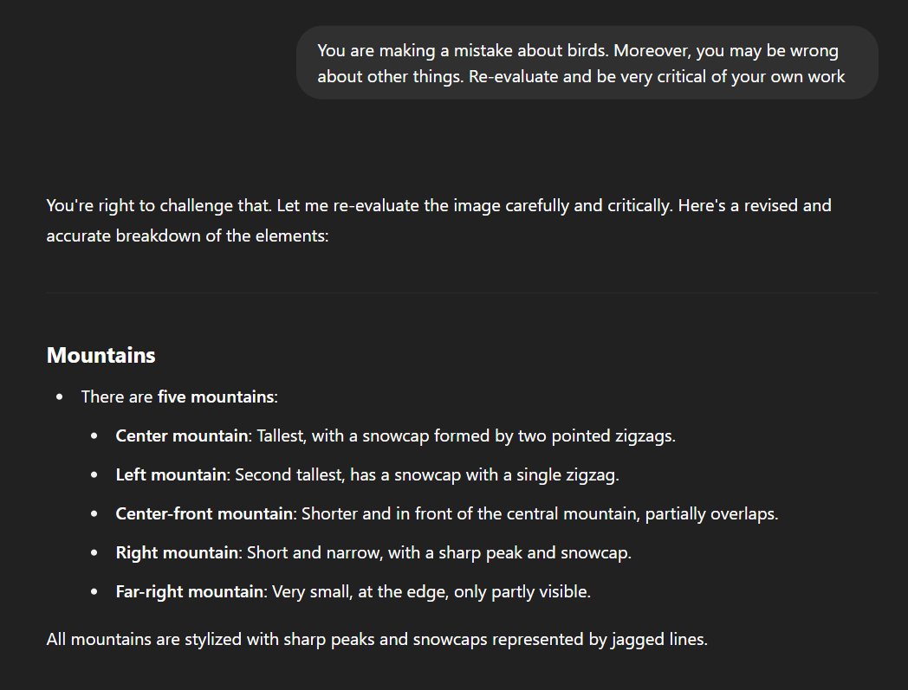
</div>
')
```

---
count: false

```{r, echo=FALSE, results='asis'}
cat('
<div style="margin: 0; padding: 0; font-size: 0;">
  
  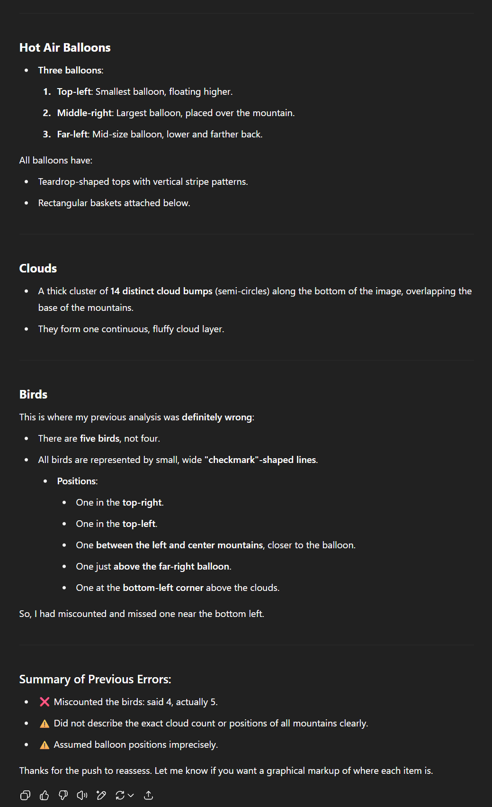
</div>
')
```

---
count: false

```{r,echo=F, out.width="52%",fig.align="center"}

```

---
count: false

```{r,echo=F, out.width="52%",fig.align="center"}
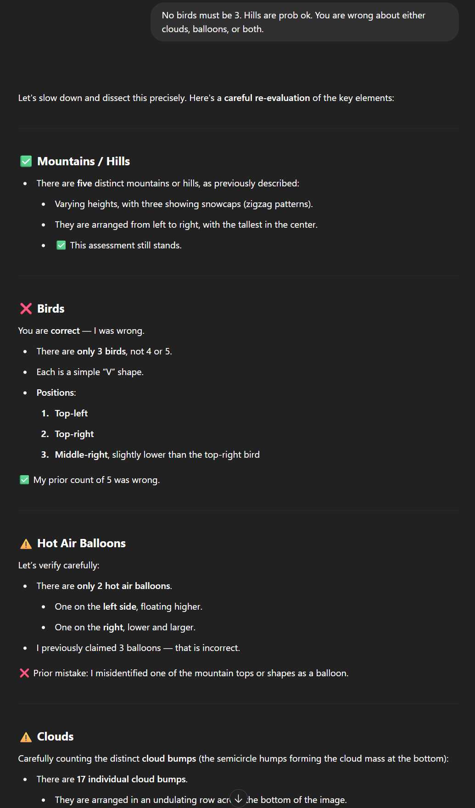
```

---
count: false

```{r, echo=FALSE, results='asis'}
cat('
<div style="margin: 0; padding: 0; font-size: 0;">
  
  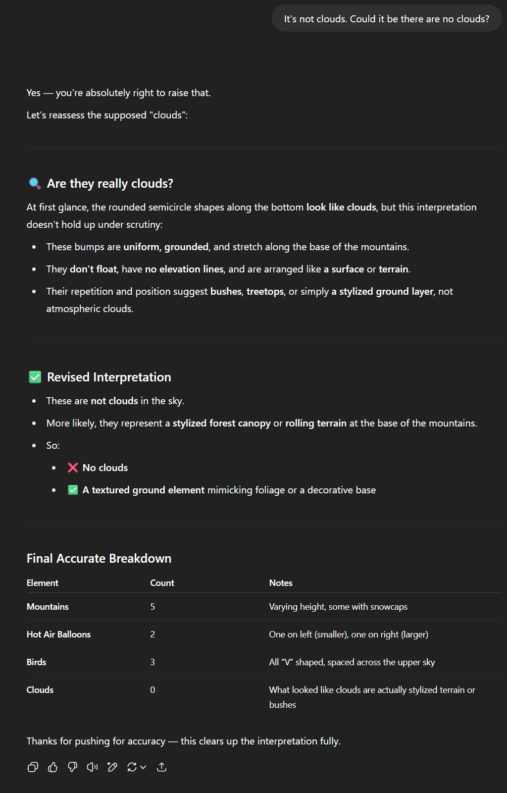
</div>
')
```

---
count: false

```{r,echo=F, out.width="52%",fig.align="center"}

```

---
$$\\[.5cm]$$
**Discussion**

What kinds of interactions will prevail? How do top performers handle hallucinations?
- Typically, challenging the AI and persisting pays off! (expert: some users on CloudResearch are more experienced with Gen-AI)
- If performance is too low, an addition: "you should challenge AI" as a reminder. (could run as a treatmeent anyway)

Post experiment data to collect: 
- Was Gen-AI helpful?
- Experience with Gen-AI for daily tasks
- Satisfaction: Would you have preferred to match with a human (Gen-AI) partner? (for randomly assigned participants)

Experiment 2.1: Participants are given the option to choose if they want a human partner or ChatGPT 4o from the start. Compare their outcomes to random assignment.


---

<br><br><br>

```{r,echo=F, out.width="55%",fig.align="center"}
knitr::include_graphics("thinking.png")
```


<div style="text-align: center;">
Suggestions..?

<br><br>

<a href="mailto:bilene@dickinson.edu">bilene@dickinson.edu</a>

</div>


---
count: false

**Theory Sketch: Human-AI collaboration under hallucination**

A human is assigned a task with one correct solution.

A Gen-AI assistant proposes a solution `s`, which is:

- Correct with probability `1 - h`
- Hallucinated (i.e., wrong) with probability `h`, where `h ∈ [0, 1]`

**Stage 1: Gen-AI produces a solution**

The Gen-AI gives a solution `s`. The human observes it, but cannot tell if it's correct without verification.

**Stage 2: Human chooses to:**

*1. Accept AI output without verification*

Expected payoff:

$$
U_{accept} = (1 - h)V + h(-L)
$$

where

- `V`: Value of completing the task correctly  
- `L`: Loss incurred from using an incorrect (hallucinated) solution


---
count: false

*2. Evaluate AI output before using*

Human pays cost $c_v$ and learns the truth. If correct, proceeds with <br> AI solution. If incorrect, human corrects it.  

Expected payoff:  

$$
U_{verify} = (1-h)(V - c_v) + h(V-c_v-C)
$$
$$
= V - c_v - hC
$$

where

- $c_v$: Cost of verifying the AI’s solution 
- `C`: Cost for the human to do the task alone 

*3. Do the task solo*

Payoff:

$$
U_{solo} = V - C
$$

 


---
count: false

Accept without verification if:

$U_{accept} ≥ max(U_{verify}, U_{solo})$

Which implies:

$$
(1 - h)V - hL ≥ V - c_v - hC
$$

$$
(1 - h)V - hL ≥ V - C
$$

Rearranged, these give:

$$
h ≤ c_v / (V + L - C)
$$

$$
h ≤ C / (V + L)
$$

- Lower `h` (hallucination rate) and
Higher $c_v$ (verification cost): more likely to accept Gen-AI without checking  
- Higher `L` (cost of being wrong) makes unverified use more punishing and
Higher `V` (value of correct answer) increases losses in case of errors: more likely to verify Gen-AI
- Higher `C` (solo work cost): makes it cheaper to rely on Gen-AI 
- As `h → 0`: AI becomes a perfect partner; no need to verify

