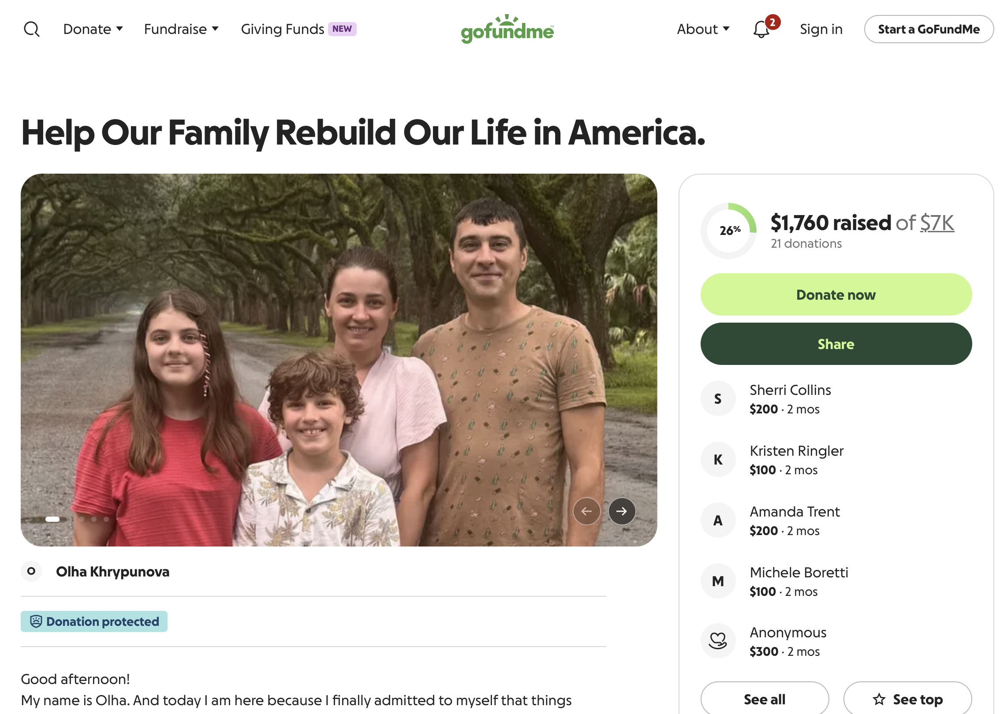
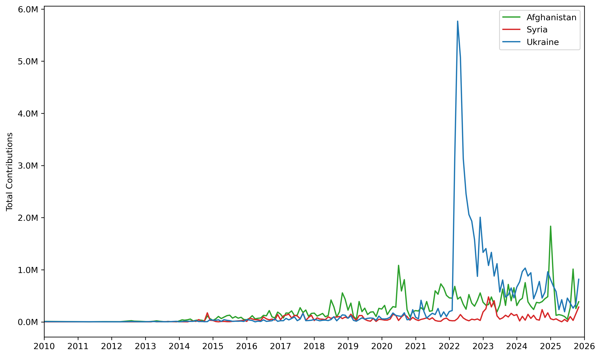
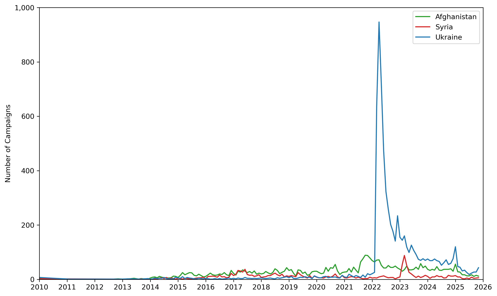
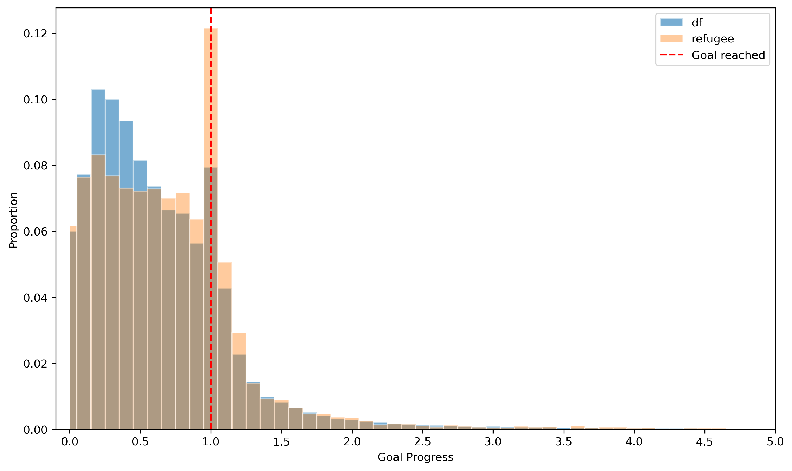
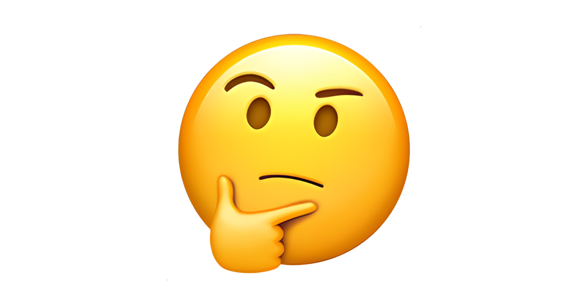

<style>
.caption {
  text-align: center;
  font-size: 14px;
}
</style>

<!--
.caption:before {
  content:"Figure: ";
  font-weight: bold;
} -->

```{r setup, include=FALSE}
options(htmltools.dir.version = FALSE)
```

```{r,echo=F}
#library(countdown)
#countdown(minutes = 0, seconds = 10, top = 2,left = 5, right = 5)
```

<br><br>
**Where Am I with this idea:**

"Nationalism in Online Games During War", with Nino Doghonadze (Uber), Robizon Khubulashvili (U of San Francisco), David Smerdon (U of Queensland): studies online chess to understand if hostile pairings show more aggression after war.

Interested in studying refugees from the Ukraine-Russia war.

I was in Poland and Turkey last month.

My anectodal conversations with locals were: they were unhappy despite governmental programs towards easy asylum.

In the US: it's... political. Democrat voters show continued support.

The Uniting for Ukraine (U4U) program has been on pause since January 2025.

---

<br><br>
**Observational Data**

Gofundme.com: "a crowdfunding platform that allows people to raise money for events ranging from life events such as celebrations and graduations to challenging circumstances like accidents and illnesses."

I observe the population of campaigns since 2011 (about 2 million campaigns, ~40 billion $ raised). 

Specifically:
Campaign title/description, goal, total amount raised, individual contributions (self reported name, timestamp, amount)

```{r,echo=F, out.width="55%",fig.align="center"}

```

---

<br><br>
**Observational Data: explorations**

```{r,echo=F, out.width="99%",fig.align="center"}

```

---

<br><br>
**Observational Data: explorations**

```{r,echo=F, out.width="99%",fig.align="center"}

```

---

<br><br>
**Observational Data: explorations**

```{r,echo=F, out.width="99%",fig.align="center"}

```


---

<br><br>
**Observational Data**

I am really interested in people who see a campaign (on the platform or though social media) and refuse/unable to contribute.

- They already contributed to something else (budget issue)
- Don't support the campaign/don't think it's top priority
- among other reasons (that I may be missing!)

I only observe donors. I don't observe anyone who does not donate.

---

<br><br>
**Observational Data + Experiment**

Allocation task on Cloudresearch. participation fee + $2 "choose where to donate" (or keep a portion)

Experiment 1: Crowding-out<br>
Control: a menu of options to donate, 5 neutral options.<br>
Treatment: 4 neutral + 1 Ukrainian refugee option.

Idea for Experiment 2: who receives more support<br>
Control: a neutral campaign<br>
Treatment 1: a single mother with kids migrated to U.S.<br>
Treatment 2: a military-age male migrated to U.S.

Idea for Experiment 3: where is the receiver<br>
Control: a neutral campaign<br>
Treatment 1: a Ukrainian family who already migrated to U.S.<br>
Treatment 2: a Ukrainian family who needs support in Ukraine.

Idea for Experiment 4: will they return<br>
Control: a neutral campaign<br>
Treatment 1: a Ukrainian family states they need temporary help/will return.<br>
Treatment 2: a Ukrainian family states they are building a new life in U.S.

Bonus Experiment 5: I vs. neighbor who started the campaign

---

<br><br>
**Discussion**

Maybe more concisely: Does the refugee's relationship to their homeland change how much Americans give?

Work that contributes to:<br>
Deservingness attributes in admission preferences in the EU (Bansak, Science)<br>
Racial closeness in giving for Hurricane Katrina (Fong & Luttmer, AEJ Applied)

Potentially expand to other refugee groups too (though not so sure).
---

<br><br><br>

```{r,echo=F, out.width="55%",fig.align="center"}

```


<div style="text-align: center;">
Suggestions..?

<br><br>

<a href="mailto:bilene@dickinson.edu">bilene@dickinson.edu</a>

</div>


